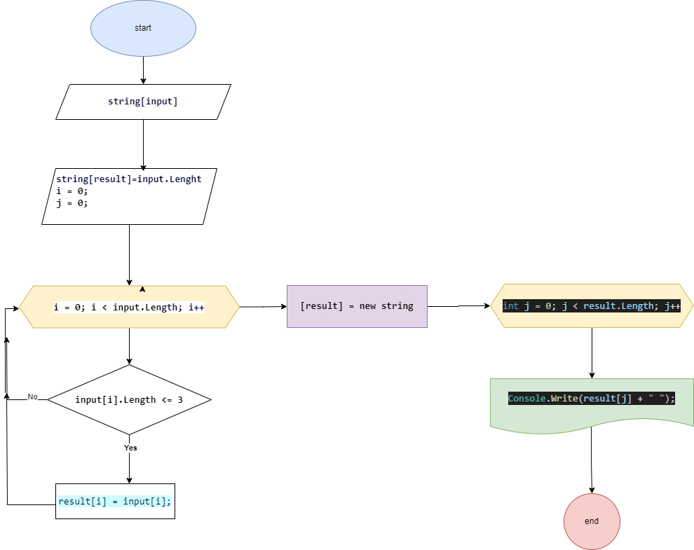

# Итоговая контрольная работа по основному блоку
### 1. Создать репозиторий на GitHub
### 2. Нарисовать блок-схему алгоритма (можно обойтись блок-схемой основной содержательной части, если вы выделяете её в отдельный метод)
### 3. Снабдить репозиторий оформленным текстовым описанием решения (файл README.md)
### 4. Написать программу, решающую поставленную задачу
### 5. Использовать контроль версий в работе над этим небольшим проектом (не должно быть так, что всё залито одним коммитом, как минимум этапы 2, 3, и 4 должны быть расположены в разных коммитах)

# **Задача:**
### *Написать программу, которая из имеющегося массива строк формирует новый массив из строк, длина которых меньше, либо равна 3 символам. Первоначальный массив можно ввести с клавиатуры, либо задать на старте выполнения алгоритма. При решении не рекомендуется пользоваться коллекциями, лучше обойтись исключительно массивами.*

# Pешение (описание)

   1) В этой программе мы сначала запрашиваем строки у пользователя используя метод Console.ReadLine() и сохраняем их в массиве input,
    разделяя полученый массив строк пробелом с помощью метода String.Split(' ') разбивая входную строку по одному или нескольким разделителям.

   2. Затем мы проходим по этому массиву с помощью цикла for и формируем новый массив result 
      который содержит только строки длиной <= 3 символам, с помощью оператора if. 

   3) В конце программы используя цикл for мы выводим новый массив result на экран использую стандартный метод Console.Write из имен класса System. 

> ******Ниже приведена блок-схема решения задачи.******
> ***
*  Обратите внимание, что эта программа предполагает, что пользователь вводит строки через пробел. Если вам нужно другое поведение, 
вы можете изменить код соответствующим образом.

> 